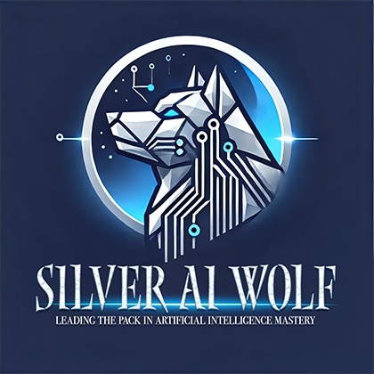

# SilverAIWolf Learning

## Overview
The purpose of this repository is to document my learning journey in the field of Data Science and Machine Learning and to share my knowledge with the community. I will be sharing tutorials, code snippets, and best practices that I have learned over the years. I will be using Python as the primary programming language and Jupyter Notebooks as the primary tool for documentation.

It is mainly foucused in the following areas:
- Data Engineering
    - Data Ingestion
    - Data Processing
    - Data Storage
    - Data Analysis
- Classical Machine Learning
    - Supervised Learning
    - Unsupervised Learning
    - Semi-Supervised Learning
    - Reinforcement Learning
- Neural Networks & Deep Learning
    - Convolutional Neural Networks
    - Recurrent Neural Networks
    - Generative Adversarial Networks
    - Transformers
- Natural Language Processing
    - Text Classification
    - Named Entity Recognition
    - Sentiment Analysis
    - Machine Translation
    - Question Answering
- Computer Vision
    - Object Detection
    - Image Segmentation
    - Image Classification
    - Image Generation
- Time Series Forecasting
    - ARIMA
    - SARIMA
    - SARIMAX
    - LSTM
    - Prophet
- Real-time Data Processing
- Online Model Monitoring
- Model Deployment & Serving
- Asynchronous Programming for Model Serving
- Model Interpretability, Explainability and Fairness
- A/B Testing
- Software Engineering Best Practices for Data Science Projects

## Completed Tutorials

## Work in Progress

- [ ] [MLflow Model Serving](https://github.com/samlexrod/sakeoflearning/blob/master/tutorials/tools-and-frameworks/mlflow/mlflow-model-serving.ipynb)
- [ ] [MLflow FastAPI Integration](https://github.com/samlexrod/sakeoflearning/blob/master/tutorials/tools-and-frameworks/mlflow/mlflow-fastapi-integration.ipynb)
- [ ] [FastAPI Websockets Integration](https://github.com/samlexrod/sakeoflearning/blob/master/tutorials/tools-and-frameworks/fastapi/fastapi-websockets-integration.ipynb)
- [ ] [FastAPI Real-time API](https://github.com/samlexrod/sakeoflearning/blob/master/tutorials/tools-and-frameworks/fastapi/fastapi-real-time-api.ipynb)
- [ ] [FastAPI Model Serving](https://github.com/samlexrod/sakeoflearning/blob/master/tutorials/tools-and-frameworks/fastapi/fastapi-model-serving.ipynb)
- [ ] [Dockerize FastAPI App](https://github.com/samlexrod/sakeoflearning/blob/master/tutorials/tools-and-frameworks/docker/dockerize-fastapi-app.ipynb)
- [ ] [Deploy FastAPI with Kubernetes](https://github.com/samlexrod/sakeoflearning/blob/master/tutorials/tools-and-frameworks/docker/deploy-fastapi-with-kubernetes.ipynb)
- [ ] [Real-time Streaming with Kafka](https://github.com/samlexrod/sakeoflearning/blob/master/tutorials/data-engineering/real-time-data/real-time-streaming-with-kafka.ipynb)
- [ ] [Real-time Ingestion with Kafka](https://github.com/samlexrod/sakeoflearning/blob/master/tutorials/data-engineering/data-ingestion/real-time-ingestion-with-kafka.ipynb)
- [ ] [Real-time Analytics with Flink](https://github.com/samlexrod/sakeoflearning/blob/master/tutorials/data-engineering/real-time-data/real-time-analytics-with-flink.ipynb)